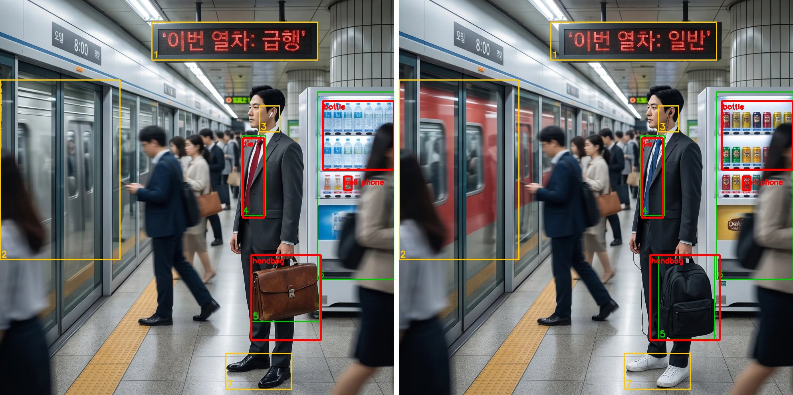

# CV-YOLO — YOLOv8 기반 제조 데이터 객체 탐지 + 틀린그림찾기

제조 공정 영상(작업대 위 **신발 + 도장**)에서 YOLO로 물체를 탐지하고, 모델·데이터·촬영 조건에 따른 성능 범위를 실험한 프로젝트입니다.

- 📓 **실습 노트북**: [notebooks/yolov8_manufacturing_practice.ipynb](notebooks/yolov8_manufacturing_practice.ipynb) (GitHub 표시용: 이미지 압축·출력 정리)
  - 원본(실행 직후 그대로, 5.1MB): [yolov8_manufacturing_practice_original.ipynb](notebooks/yolov8_manufacturing_practice_original.ipynb) — 용량 때문에 GitHub 웹에서는 안 열릴 수 있어 내려받아 Jupyter로 열어 주세요
- 📄 **제출용 PDF** (노트북 전체, 50쪽): [CV-YOLO_제출본.pdf](CV-YOLO_제출본.pdf)

## 노트북 구성

**과제 기본 코드를 원본 순서·코드 그대로** 따라가며 코드마다 아래에 의미를 정리하고, 파트가 끝날 때마다 **개인 실험**을 덧붙였습니다.
(원본과 다른 곳은 문법 오류였던 `import requests=` 수정, 평가표에 이번 실행 값을 넣은 것 두 곳뿐입니다.)

| 파트 | 내용 |
|---|---|
| Part 1. YOLOv8 확인하기 | 버스 이미지 추론, `Results`/`Boxes` 구조, xywh·xyxy·정규화 좌표 직접 계산, 시각화, 클래스 필터링, crop |
| 🔬 개인 실험 1 | 신뢰도 임계값, 추가 샘플(zidane)로 모델 비교(버전: v8n vs **11n**, 크기: v8n vs v8s), IoU·NMS |
| Part 2. YOLOv8 학습 | Roboflow stamp v10 학습(20 epoch) → 검증 → 평가표 → test 이미지 예측 |
| 🔬 개인 실험 2 | 2-1 모델 비교(버전·크기·학습 길이) / 2-2 신뢰도 최적화 — 각각 가설 → 결과 → 이유 순서 |
| 정리 | 목표 기준 평가, **막혔던 부분과 해결**, 개인 회고(KPT / AAR) |

## 결과 요약

**기본 학습 (YOLOv8n, 20 epoch, valid 273장)**

| Class | Precision | Recall | mAP@.5 | mAP@.5:.95 |
|---|---|---|---|---|
| all | 0.953 | 0.987 | 0.985 | 0.640 |
| shoes | 0.928 | 0.974 | 0.975 | 0.717 |
| stamp | 0.978 | 1.000 | 0.995 | 0.562 |

**모델 비교 (test 193장)** — 같은 조건끼리 비교

| 모델 | 비교 | mAP50 | mAP50-95 | 파라미터 |
|---|---|---|---|---|
| YOLOv8n · 20에폭 | 기준 | 0.985 | 0.627 | 3.0M |
| YOLO11n · 20에폭 | 버전 (nano끼리) | 0.982 | **0.634** | **2.6M** |
| YOLOv8s · 20에폭 | 크기 (v8끼리) | 0.975 | 0.628 | 11.1M |
| YOLOv8n · 50에폭 | 학습 길이 | 0.979 | 0.626 | 3.0M |


**신뢰도 최적화 (YOLO11n, test 193장)**

| | 신뢰도 | 정밀도 | 재현율 | F1 |
|---|---|---|---|---|
| 기본값 | 0.25 | 0.961 | 0.946 | 0.954 |
| 최적값 (valid에서 선택) | 0.55 | **0.980** | 0.935 | **0.957** |

**핵심 발견**
- 최신 모델(YOLO11n)이 v8n보다 조금 우수하고 더 가볍지만, 모델 크기·버전·학습 길이를 바꿔도 성능 차이는 0.01 이내였습니다. 한계는 모델보다 **데이터**(가장자리·손에 든 신발 같은 드문 장면)에 있습니다.
- 신뢰도를 올리면 오탐이 줄어 정밀도가 0.98까지 오르지만, 전체 성능(F1)은 거의 같습니다.
- 도장은 검증 재현율 1.000으로, "도장이 찍혔는지" 확인하는 공정 목적에는 충분합니다.

## 틀린그림찾기 핵 (spotdiff)

두 그림에서 다른 곳을 **YOLO로** 찾아 표시하는 두 번째 과제입니다. YOLO로 두 그림의 물체를 전부 찾고, 박스끼리 짝지어 비교합니다.

- 📓 **노트북**: [spotdiff/spotdiff_yolo.ipynb](spotdiff/spotdiff_yolo.ipynb) — 데이터 확인 → YOLO 탐지 → 짝짓기 → 내용 비교 → 5문제 채점
- 📝 **작업 기록**: [spotdiff/report/작업기록.md](spotdiff/report/작업기록.md) ([PDF](spotdiff/report/작업기록.pdf)) — 흐름 단위 시행착오
- 🧩 **데이터**: [spotdiff/dataset_ai/](spotdiff/dataset_ai/) — Gemini로 만든 5문제 (A·B 그림, [정답표](spotdiff/dataset_ai/정답표.md), 정답 위치 `answers.json`)

**흐름**: 틀린그림찾기 만들기 → 선 그림 도안은 YOLO가 물체를 못 찾고, 사진을 직접 편집한 데이터는 부자연스러워서 데이터셋 구하기가 어려움 → **Gemini로 문제 그림 생성** → 탐지기 제작

**탐지기** ([spotdiff/src/detect_diff.py](spotdiff/src/detect_diff.py))

1. YOLO11x로 A·B의 물체를 모두 탐지 (신뢰도 0.10)
2. 겹치는 박스끼리 짝짓기 (IoU ≥ 0.5): 짝이 없거나 클래스가 다르면 후보
3. 후보 자리를 A·B에서 잘라 내용 비교: 조각을 맞춘 뒤 **색이 바뀐 픽셀 비율**, 색 분포 거리
4. 같은 종류는 묶고, 겹치면 작은 박스만 남김

**결과 (5문제, 정답 35개)**

| 문제 | 정답 | 찾음 | 탐지 | 맞음 |
|---|---|---|---|---|
| cafe_01 | 6 | 3 | 3 | 3 |
| plaza_01 | 8 | 8 | 11 | 11 |
| subway_01 | 7 | 3 | 4 | 4 |
| camping_01 | 7 | 5 | 4 | 4 |
| bookstore_01 | 7 | 4 | 4 | 4 |
| **합계** | **35** | **23** | **26** | **26** |

재현율 **65.7%**, 정밀도 **100%**. 놓친 12개 중 8개는 안경·모자·팻말처럼 YOLO가 배운 80가지 물체(COCO)에 없는 것이라 박스 자체가 생기지 않았습니다.



## 레포 구조

```
CV-YOLO/
├── notebooks/
│   ├── yolov8_manufacturing_practice.ipynb            # 실습 + 개인 실험 + 회고 (제출 본문, GitHub 표시용)
│   ├── yolov8_manufacturing_practice_original.ipynb   # 위와 같은 내용의 원본 (이미지·출력 그대로)
│   └── 03_my_defect_detection.ipynb          # (진행 예정) 직접 촬영한 정상/불량 제품 탐지
├── src/                  # 노트북 흐름을 재사용 가능한 스크립트로 리팩터링
│   ├── common.py         # 경로·클래스·디바이스 설정
│   ├── capture.py        # 웹캠 촬영
│   ├── label.py          # OpenCV 박스 라벨링 도구 → YOLO txt
│   ├── split.py          # train/val 분할 + data.yaml 생성
│   ├── train.py          # 파인튜닝
│   ├── evaluate.py       # mAP + 판 단위 OK/NG 판정, 촬영 조건 강건성
│   └── live.py           # 웹캠 실시간 정상/불량 표시
├── tools/
│   ├── make_pdf.py           # 노트북 → 제출용 PDF
│   └── shrink_notebook.py    # 노트북 이미지 용량 줄이기 (GitHub 표시용)
├── spotdiff/             # 틀린그림찾기 핵
│   ├── spotdiff_yolo.ipynb   # 탐지기 노트북 (실행 결과 포함)
│   ├── dataset_ai/           # Gemini로 만든 5문제: original/, A/, B/, 정답표.md, answers.json
│   ├── results_ai/           # 탐지 결과 이미지, 기준선 산점도, score.json
│   ├── report/               # 작업기록.md / .pdf, 그림
│   ├── src/
│   │   ├── detect_diff.py        # 탐지기 + 채점
│   │   ├── prepare_pairs.py      # Gemini 그림에서 A·B 그림만 잘라내기
│   │   ├── make_report_pdf.py    # 작업기록 → PDF
│   │   ├── make_city_dataset.py  # (시행착오) COCO 사진 직접 편집
│   │   └── find_diff.py          # (시행착오) 픽셀 차이 방식
│   └── dataset_city/, results/   # 시행착오 기록용
├── report/images/        # 그래프
├── results/              # 실험 결과 csv
└── CV-YOLO_제출본.pdf
```

`data/`, `datasets/`, `runs/`, `*.pt`는 용량이 커서 커밋하지 않습니다.

## 재현 방법

```bash
python -m venv .venv
.venv\Scripts\activate
pip install torch torchvision --index-url https://download.pytorch.org/whl/cu128   # RTX 50 시리즈
pip install -r requirements.txt
python -m ipykernel install --sys-prefix --name cv-yolo --display-name "CV-YOLO (.venv)"
```

1. [Roboflow stamp 데이터셋](https://universe.roboflow.com/warisara-kaewsuwan-cf2hs/stamp-bcrhe) **v10**을 YOLOv8 형식으로 받아 `datasets/stamp/`에 압축 해제 (노트북의 `../datasets/stamp/...` 경로와 맞춤)
2. `Jupyter_실행.bat` 실행 → `yolov8_manufacturing_practice.ipynb`를 **CV-YOLO (.venv)** 커널로 실행
3. 이미지 용량 줄이기: `python tools/shrink_notebook.py notebooks/yolov8_manufacturing_practice.ipynb`
4. PDF 생성: `python tools/make_pdf.py`

**틀린그림찾기**: `spotdiff` 폴더에서 `spotdiff_yolo.ipynb`를 **CV-YOLO (.venv)** 커널로 실행하거나, `python spotdiff/src/detect_diff.py`로 채점만 돌립니다. YOLO11x 가중치는 처음 실행할 때 자동으로 내려받습니다.

## 환경
Windows 11 · Python 3.11 · PyTorch 2.11 (CUDA 12.8) · Ultralytics 8.4.154 · RTX 5060 Laptop 8GB
