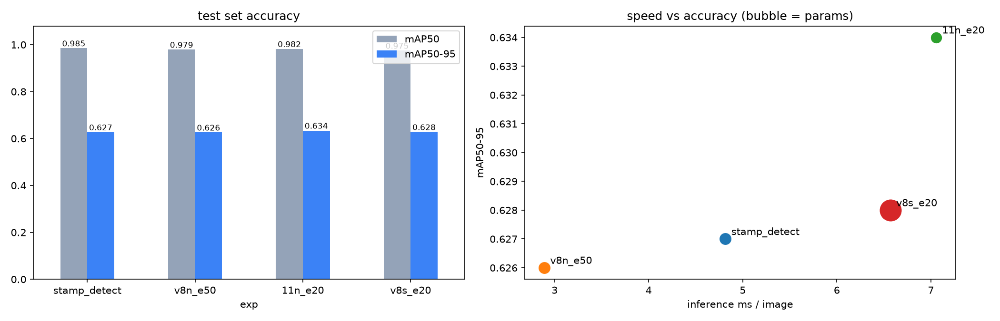

# CV-YOLO — YOLOv8 기반 제조 데이터 객체 탐지

제조 공정 영상(작업대 위 **신발 + 도장**)에서 YOLO로 물체를 탐지하고, 모델·데이터·촬영 조건에 따른 성능 범위를 실험한 프로젝트입니다.

- 📓 **실습 노트북**: [notebooks/yolov8_manufacturing_practice.ipynb](notebooks/yolov8_manufacturing_practice.ipynb)
- 📄 **제출용 PDF** (노트북 전체, 48쪽): [CV-YOLO_제출본.pdf](CV-YOLO_제출본.pdf)

## 노트북 구성

**과제 기본 코드를 원본 순서·코드 그대로** 따라가며 코드마다 아래에 의미를 정리하고, 파트가 끝날 때마다 **개인 실험**을 덧붙였습니다.
(원본과 다른 곳은 문법 오류였던 `import requests=` 수정, 평가표에 이번 실행 값을 넣은 것 두 곳뿐입니다.)

| 파트 | 내용 |
|---|---|
| Part 1. YOLOv8 확인하기 | 버스 이미지 추론, `Results`/`Boxes` 구조, xywh·xyxy·정규화 좌표 직접 계산, 시각화, 클래스 필터링, crop |
| 🔬 개인 실험 1 | 신뢰도 임계값, 추가 샘플(zidane) × 모델 3종(YOLOv8n/s, **YOLO11n**), NMS IoU |
| Part 2. YOLOv8 학습 | Roboflow stamp v10 학습(20 epoch) → 검증 → 평가표 → test 이미지 예측 |
| 🔬 개인 실험 2 | 2-0 데이터 분포·학습 곡선·혼동행렬·평가표 자동화 / 2-1 모델·에폭 비교 / 2-2 신뢰도 최적화 / 2-3 **촬영 조건 5종** / 2-4 오류 사례 (2-1·2-2는 가설 → 결과 → 분석 → 이유 순서) |
| 정리 | 목표 기준 평가, **막혔던 부분과 해결**, 개인 회고(KPT / AAR) |

## 결과 요약

**기본 학습 (YOLOv8n, 20 epoch, valid 273장)**

| Class | Precision | Recall | mAP@.5 | mAP@.5:.95 |
|---|---|---|---|---|
| all | 0.953 | 0.987 | 0.985 | 0.640 |
| shoes | 0.928 | 0.974 | 0.975 | 0.717 |
| stamp | 0.978 | 1.000 | 0.995 | 0.562 |

**모델·에폭 비교 (test 193장)**

| 실험 | 파라미터 | mAP50 | mAP50-95 | stamp mAP50-95 |
|---|---|---|---|---|
| YOLOv8n · 20ep | 3.01M | **0.985** | 0.627 | 0.558 |
| YOLOv8n · 50ep | 3.01M | 0.979 | 0.626 | 0.553 |
| YOLO11n · 20ep | **2.59M** | 0.982 | **0.634** | **0.576** |
| YOLOv8s · 20ep | 11.14M | 0.975 | 0.628 | 0.564 |



**촬영 조건 변화 (YOLO11n, test 193장)**

| 조건 | mAP50 | mAP50-95 | shoes Recall | stamp Recall |
|---|---|---|---|---|
| original | 0.983 | 0.634 | 0.869 | 0.990 |
| dark | 0.981 | 0.627 | 0.852 | 0.984 |
| bright | 0.972 | 0.635 | 0.816 | 0.988 |
| blur | 0.939 | **0.483** | 0.811 | 0.974 |
| noise | 0.909 | 0.589 | **0.677** | 0.961 |

**핵심 발견**
- 50 epoch, 큰 모델(v8s), 다른 모델(YOLO11n) 모두 test mAP50-95가 0.626~0.634로, 같은 설정을 다시 학습할 때 생기는 흔들림(±0.01)과 비슷한 차이였습니다. 한계는 모델보다 **데이터**(작은 도장의 박스 정밀도, 가장자리·손에 가려진 신발)에 있습니다.
- 조명 변화에는 강하지만 **흐림(박스 정밀도)과 노이즈(신발 탐지)** 에서 성능이 떨어집니다. 현장에서는 카메라 초점·조명 고정과 블러·노이즈 증강이 필요합니다.
- 도장은 검증 Recall 1.000으로, "도장이 찍혔는지" 확인하는 공정 목적에는 충분합니다.

## 레포 구조

```
CV-YOLO/
├── notebooks/
│   ├── yolov8_manufacturing_practice.ipynb   # 실습 + 개인 실험 + 회고 (제출 본문)
│   └── 03_my_defect_detection.ipynb          # (진행 예정) 직접 촬영한 정상/불량 제품 탐지
├── src/                  # 노트북 흐름을 재사용 가능한 스크립트로 리팩터링
│   ├── common.py         # 경로·클래스·디바이스 설정
│   ├── capture.py        # 웹캠 촬영
│   ├── label.py          # OpenCV 박스 라벨링 도구 → YOLO txt
│   ├── split.py          # train/val 분할 + data.yaml 생성
│   ├── train.py          # 파인튜닝
│   ├── evaluate.py       # mAP + 판 단위 OK/NG 판정, 촬영 조건 강건성
│   └── live.py           # 웹캠 실시간 정상/불량 표시
├── tools/
│   ├── make_pdf.py           # 노트북 → 제출용 PDF
│   └── shrink_notebook.py    # 노트북 이미지 용량 줄이기 (GitHub 표시용)
├── report/images/        # 그래프
├── results/              # 실험 결과 csv
└── CV-YOLO_제출본.pdf
```

`data/`, `datasets/`, `runs/`, `*.pt`는 용량이 커서 커밋하지 않습니다.

## 재현 방법

```bash
python -m venv .venv
.venv\Scripts\activate
pip install torch torchvision --index-url https://download.pytorch.org/whl/cu128   # RTX 50 시리즈
pip install -r requirements.txt
python -m ipykernel install --sys-prefix --name cv-yolo --display-name "CV-YOLO (.venv)"
```

1. [Roboflow stamp 데이터셋](https://universe.roboflow.com/warisara-kaewsuwan-cf2hs/stamp-bcrhe) **v10**을 YOLOv8 형식으로 받아 `datasets/stamp/`에 압축 해제 (노트북의 `../datasets/stamp/...` 경로와 맞춤)
2. `Jupyter_실행.bat` 실행 → `yolov8_manufacturing_practice.ipynb`를 **CV-YOLO (.venv)** 커널로 실행
3. 이미지 용량 줄이기: `python tools/shrink_notebook.py notebooks/yolov8_manufacturing_practice.ipynb`
4. PDF 생성: `python tools/make_pdf.py`

## 환경
Windows 11 · Python 3.11 · PyTorch 2.11 (CUDA 12.8) · Ultralytics 8.4.154 · RTX 5060 Laptop 8GB
