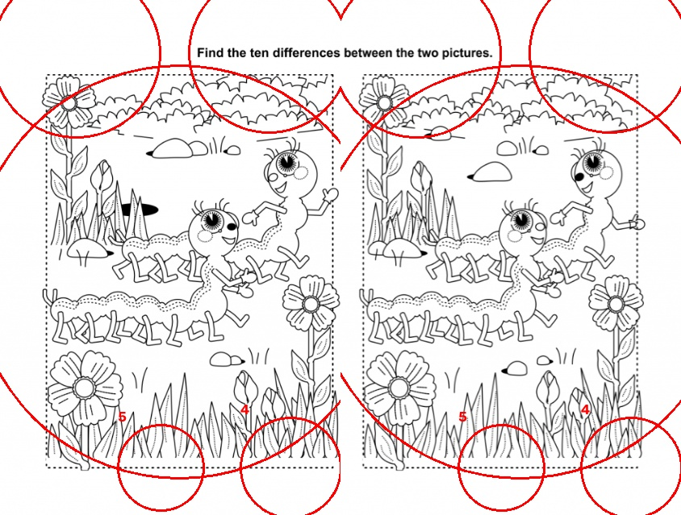
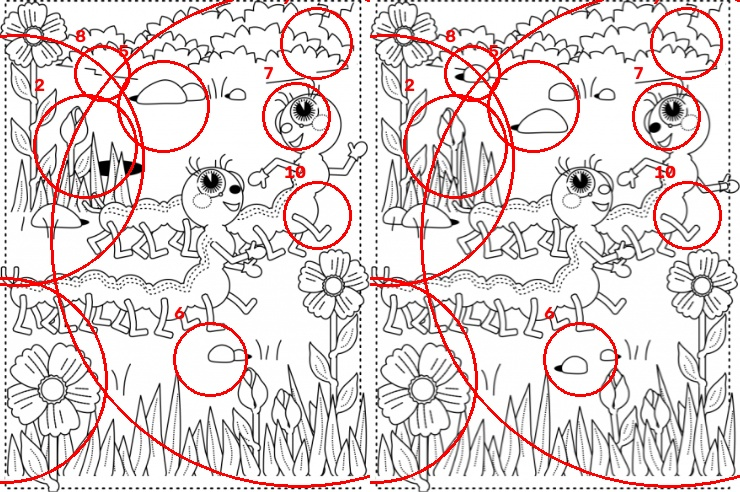
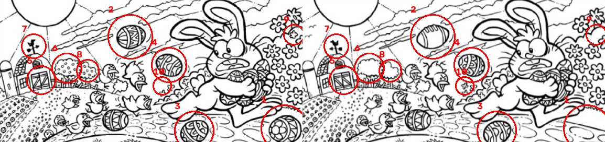

# 틀린그림찾기 핵 — 작업 기록

만들면서 겪은 문제와 해결 과정을 **흐름 단위**로 남긴다. 보고서에 그대로 쓸 수 있게 결과 이미지도 함께 저장한다.

- 목표: 틀린그림찾기 도안에서 다른 곳을 자동으로 찾아 동그라미로 표시하기
- 자료: 인터넷 도안 20장 (JPG 11 + PDF 9쪽) → `spotdiff/data/raw/`
- 1단계는 고전 영상처리로 동작하게 만들고, 2단계에서 YOLO로 학습시켜 비교할 계획

**"어긋남" 수치**: 두 그림을 겹쳤을 때 픽셀 밝기 차이의 평균. 0에 가까울수록 잘 겹친 것이고, 값이 크면 그림이 통째로 어긋나 있어 엉뚱한 곳이 차이로 잡힌다.

---

## 흐름 1. 그림 두 장 분리하기

**한 일**: 도안 한 장 안에 그림이 두 개 들어 있으므로 먼저 둘로 나눈다. 가운데 여백(잉크가 가장 적은 줄)을 찾아 좌우 또는 상하로 잘랐다.

**문제**: 제목 글자와 페이지 여백까지 그림에 섞여 들어갔다. 왼쪽 그림에는 "Find the ten differences", 오른쪽 그림에는 "between the two pictures"가 들어가는 식이라, 글자 전체가 차이로 잡혀 화면을 가로지르는 큰 원이 생겼다.

**원인**: 페이지를 기계적으로 반으로 자르면 그림이 아닌 부분(제목, 여백, 테두리)도 같이 들어간다. 어긋남도 26.1로 매우 컸다.

**해결**: 선을 굵게 부풀려 점선 테두리를 이어 붙인 뒤, 페이지의 8% 이상을 차지하면서 크기가 비슷한 사각형 두 개를 찾아 **그림 판만 잘라냈다**. 어긋남이 26.1 → 9.8로 줄었다.

---

## 흐름 2. 두 그림 겹치게 정렬하기

**한 일**: 판을 잘라내도 인쇄·스캔 상태 때문에 두 그림이 몇 픽셀씩 어긋나 있다. 그대로 빼면 모든 선이 차이로 잡히므로 먼저 겹치게 맞춘다.

**문제**: 특징점 매칭(ORB)만 쓰면 도안에 따라 실패했다. 선 그림이라 비슷한 무늬가 많아서 엉뚱한 점끼리 짝지어지는 경우가 있었다.

**해결**: 세 가지 방법을 모두 해 보고 가장 잘 맞는 것을 고르게 했다.
1. 크기만 맞추기
2. 특징점 매칭(ORB + RANSAC)
3. 위상 상관(phase correlation)으로 평행이동만 맞추기

도안마다 이긴 방법이 달랐다. 애벌레 도안은 특징점, 토끼 도안은 평행이동이 가장 잘 맞았다.

| 도안 | 흐름 1 전 | 판만 자름 | 정렬까지 |
|---|---|---|---|
| Spotthedifference_1 (애벌레) | 26.1 | 9.8 | **8.3** |
| Spotthedifference_4 (토끼) | 41.4 | 21.6 | **10.5** |

추가로 테두리 선이 차이로 잡히는 것을 막기 위해 가장자리 3%를 잘라냈다.

**결과** (토끼 도안): 공 → 럭비공, 꽃, 헛간 창문 등 실제로 다른 곳에 동그라미가 쳐졌다.

---

## 흐름 3. 남은 문제 (진행 중)

1. **판 인식 실패**: `Spotthedifference_10` 은 그림 테두리가 뚜렷하지 않아 판을 찾지 못하고 페이지를 반으로 잘랐다. 그래서 아래쪽 안내 문구("Find the 5 differences")까지 그림에 들어갔다.
2. **정렬이 덜 맞는 도안**: 애벌레 도안은 어긋남 8.3까지 줄였지만, 아직 큰 원 몇 개가 실제 차이가 아닌 어긋남 때문에 생긴다.
3. **차이 개수**: 도안마다 정답 개수가 다른데(5개, 10개 등) 지금은 `--topk` 로 직접 넣어야 한다. 안내 문구에서 숫자를 읽어 자동으로 정하는 방법을 생각 중이다.
