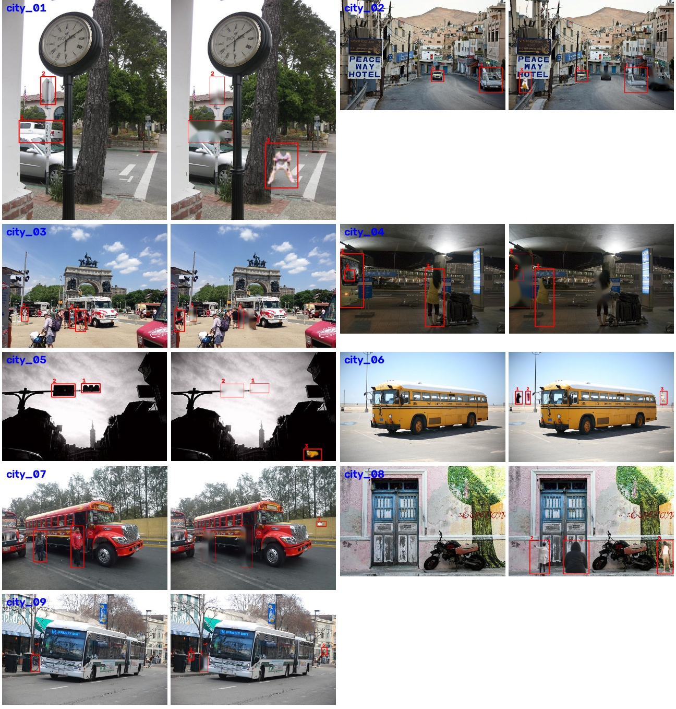

# 틀린그림찾기 핵 — 작업 기록

만들면서 겪은 문제와 해결 과정을 **흐름 단위**로 남긴다.

- 목표: 두 사진에서 다른 곳을 YOLO로 찾아 표시하기
- 아이디어: YOLO로 두 사진의 물체를 **전부 박스로 찾은 뒤, 두 사진의 박스를 비교**해서 짝이 없거나 위치가 바뀐 박스를 틀린 곳으로 본다

---

## 흐름 1. 처음 시도 — 인터넷 틀린그림 도안

인터넷에서 받은 틀린그림찾기 도안(선 그림) 20장으로 시작했다. AI에게 "틀린그림찾기 핵을 처음부터 만들어 달라"고 했더니, YOLO 대신 두 그림을 겹쳐서 픽셀 차이를 계산하는 영상처리 방식으로 만들었다. 그런데 그림 테두리를 제대로 찾지 못한 도안에서는 아래 안내 문구까지 그림으로 들어가 엉뚱한 곳에 큰 원이 잔뜩 생겼다.

---

## 흐름 2. YOLO로 도안을 보면? → 아무것도 못 찾음

원래 생각대로 YOLO로 물체를 전부 찾아 비교하려고, COCO로 사전학습된 YOLOv8n을 도안 3장에 돌려 봤다.

| 도안 | YOLOv8n이 찾은 물체 |
|---|---|
| Spotthedifference_4 (토끼) | 없음 |
| Spotthedifference_1 (애벌레) | 없음 |
| Spotthedifference_10 (자동차) | 없음 |

**원인**: 사전학습 YOLO는 사람·자동차 같은 **실제 사진**으로 배운 모델이다. 흑백 선으로만 그린 그림은 물체로 인식하지 못한다. 자동차가 그려진 도안에서도 자동차를 찾지 못했다.

**결정**: 도안 대신 **현실 사진**으로 데이터셋을 바꾼다. 현실 사진이면 사전학습 YOLO가 물체를 찾을 수 있으므로 "박스 비교" 아이디어를 그대로 쓸 수 있다.

---

## 흐름 3. 도시 사진으로 틀린그림 데이터셋 만들기

COCO 샘플 사진(128장) 중 도시 장면을 골라, 사진을 편집해 틀린 그림을 자동으로 만들었다(`src/make_city_dataset.py`). COCO 사진에는 물체 위치 정답이 있어서, 바꾼 곳의 정답도 자동으로 기록된다.

- **사라짐**: 물체 하나를 지우고 주변 배경으로 메우기
- **이동**: 물체를 같은 높이에서 옆으로 옮기기
- **추가**: 다른 사진의 물체를 가져와 붙이기

**시행착오**
1. **2문제밖에 안 나옴** → 지우기 좋은 물체(적당한 크기, 다른 물체와 안 겹침)가 사진마다 0~2개뿐이었다. 조건을 완화하고, 모자라면 다른 사진의 물체를 붙여서 채우도록 했다.
2. **붙인 물체가 부자연스러움** → 사각형째 잘라 붙여서 원래 배경이 같이 붙고, 하늘이나 나무 위에 떠 있었다. 박스 안에서 **물체 모양만 따내고(GrabCut)**, 같은 종류 물체의 **크기·발밑 높이에 맞춰 땅 위에** 놓도록 바꿨다.
3. **도시가 아닌 사진이 섞임** → 멀리 작은 차 한 대만 있어도 도시로 분류됐다(공원, 들판, 테니스장). 차·버스·신호등이 **사진의 1% 이상 크기로** 보일 때만 도시로 봤다.
4. **동그란 얼룩** → 물체 모양 따내기에 실패하면 타원으로 대신 잘랐는데, 그게 얼룩처럼 붙었다. 모양 따내기에 실패한 조각은 쓰지 않도록 했다.

**결과**: 도시 사진 9문제, 차이 27개 (사라짐 11, 이동 4, 추가 12)

그런데 직접 보니 **편집한 티가 너무 났다.** 지운 자리가 뭉개져 있고, 붙인 물체는 크기·밝기가 주변과 맞지 않아서 AI 없이도 바로 찾을 수 있었다.

**다시 시도**: 지우기는 LaMa 인페인팅(지운 자리를 주변에 맞게 새로 그려 주는 모델)으로, 물체 모양은 YOLOv8-seg 마스크로 따내고, 붙이기 대신 같은 사진 안에서 옮기거나 색을 바꾸도록 고쳤다. 차이 수는 문제당 5~7개(어려운 문제 10개)로 맞췄다.
그래도 부자연스러웠다. 아래처럼 색을 바꾸면 사람이 초록색이 되고, 버스 전체에 초록빛이 돌았다. 게다가 COCO 샘플 128장 중 도시 사진이 2장만 남아서 문제 수도 모자랐다.

**결정**: 사진을 직접 편집하는 방식은 그만두고, 처음부터 **틀린그림찾기용으로 그린 그림**을 쓴다.

- 문제: `dataset_city/A/`, `dataset_city/B/` (첫 시도 결과, 기록용으로 남김)
- 정답: `dataset_city/정답표.md`, `dataset_city/answer/`

---

## 흐름 4. Gemini로 문제 만들기

Gemini에게 장면을 설명하고 "원본 A와 7군데 다른 B를 나란히 그려 달라"고 해서 5문제를 만들었다(카페, 빌딩 숲 광장, 지하철 승강장, 캠핑장, 동네 서점).

**YOLO가 이 그림을 알아볼까?** 선 그림 도안(흐름 2)은 0개였는데, 이 그림에서는 물체를 많이 찾았다. 카페 그림에 YOLO11x를 돌린 결과:

| 모델 | A | B |
|---|---|---|
| YOLO11n | 사람 11, 의자 9, 컵 2, 폰 2, 버스 1, 노트북 1 … | 거의 같음 (**새를 못 찾음**) |
| YOLO11x | 사람 11, 의자 5, **새 3**, 버스 1, 노트북 1, 컵 1, 폰 1 … | 사람 10, 의자 5, **새 2**, … |

- 큰 모델(x)은 작은 참새까지 찾아서 **새 3마리 → 2마리** 차이가 박스 개수로 드러났다.
- 하지만 나머지 차이(버스 색, 태블릿 화면, 폰 화면, 컵 로고)는 물체가 그대로 있고 **내용만 바뀐 것**이라 박스는 A와 B에서 똑같이 나온다. 박스만 비교해서는 못 찾는다.

**픽셀 비교는 왜 안 되나?** Gemini는 B를 그릴 때 그림 전체를 새로 그린다. 그래서 A와 B를 겹쳐 빼 보면 안 바뀐 곳도 테두리마다 차이가 생긴다(아래에서 빛나는 선). 흐름 1의 픽셀 차이 방식은 여기서 쓸 수 없고, **물체 단위로 비교하는 YOLO 방식이 필요한 이유**가 된다.

**그림 정리하기** (`src/prepare_pairs.py`)

Gemini 그림에는 제목, "장면 A: 원본" 같은 판 이름, 설명 문구, 워터마크가 같이 들어 있어서 그림만 잘라냈다.

1. **글자 띠 자르기**: 글자 띠는 한 가지 배경색에 글자만 조금 있는 줄이라, 그런 줄을 빼고 그림 줄만 남겼다. 캠핑장 그림은 아래 설명 글이 깨진 한글로 나와서(Gemini가 한글 글자를 잘 못 그림) 이것도 잘라냈다.
2. **워터마크 지우기**: B판 오른쪽 아래에 Gemini 별 모양 워터마크가 있다. A에는 없으니 그대로 두면 의도하지 않은 차이가 된다.
   - 시도 1: "B에서만 밝아진 곳"을 워터마크로 봤다 → 흰 운동화, 잡지처럼 **실제로 바뀐 물체를 지워버림**
   - 시도 2: 별 모양 틀로 찾았다 → 워터마크가 옅어서 밝은 바닥 위에서는 엉뚱한 곳을 찾음
   - 시도 3: 5장 모두 별이 **같은 비율의 자리**(가장자리에서 √(가로×세로)의 11.5% 안쪽)에 있어서, 그 자리를 LaMa로 지웠다 → 5장 모두 깨끗하게 지워짐
3. **A·B 맞추기**: 두 판이 1~3픽셀 어긋나 있어서 맞춘 뒤 겹치는 부분만 남겼다.

**결과**: 5문제, 차이 34개 확인 (`dataset_ai/정답표.md`)
- 대부분이 **바뀜**(같은 자리 물체가 다른 것으로)이다. 예: 핫도그 트럭 → 아이스크림 트럭, 비둘기 → 오리, 타자기 → 축음기
- 카페 그림은 7군데라고 했지만 6개밖에 못 찾았다. Gemini가 적은 개수와 실제 차이가 다를 수 있다.

---

## 다음 흐름 (예정)

YOLO로 A·B의 물체를 전부 찾고 두 단계로 비교한다.
1. 박스끼리 짝을 짓고, 짝이 없거나 **클래스가 다르면** 틀린 곳 (예: 비둘기 → 오리는 둘 다 bird라 개수로, 타자기 → 축음기는 클래스로)
2. 짝이 맞는 박스는 **박스 안을 잘라서 비교**하고, 많이 다르면 틀린 곳 (버스 색, 화면 내용, 넥타이 색 등)

정답표와 비교해서 몇 개를 맞혔는지 점수로 평가한다.
