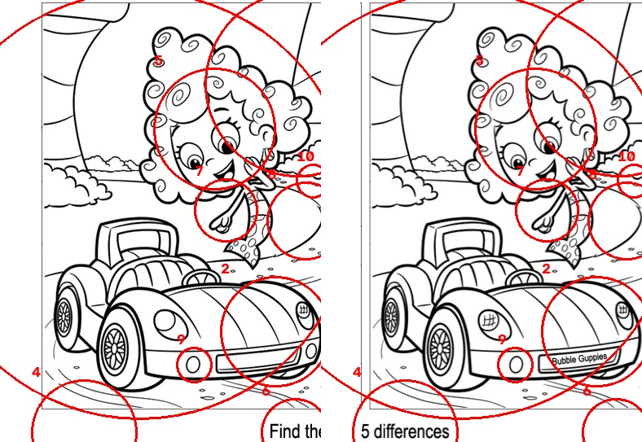
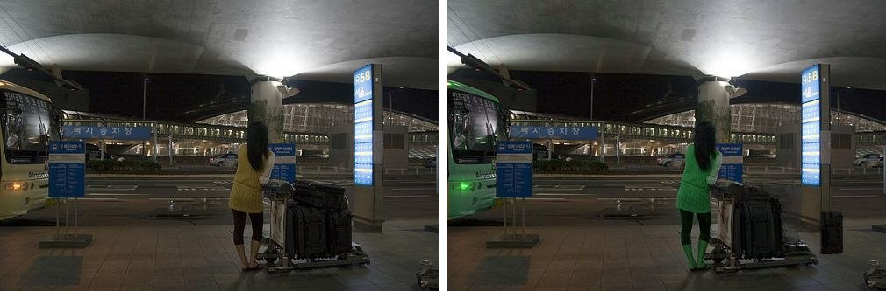
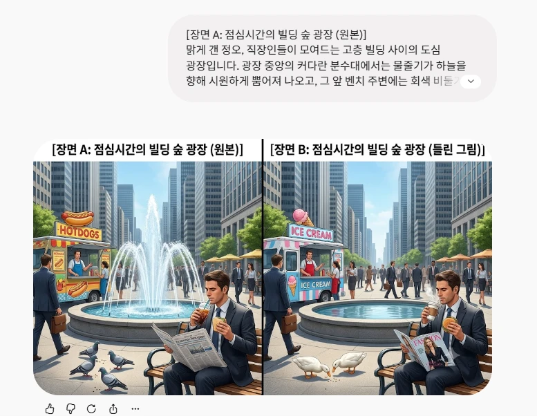
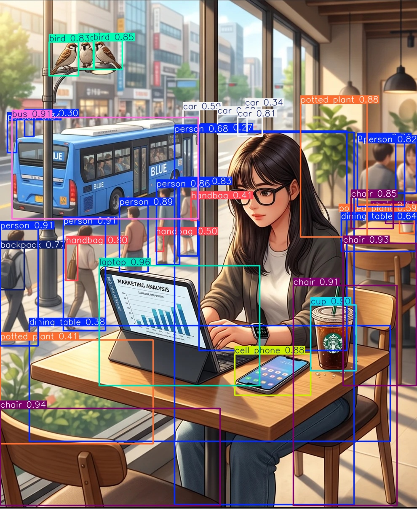
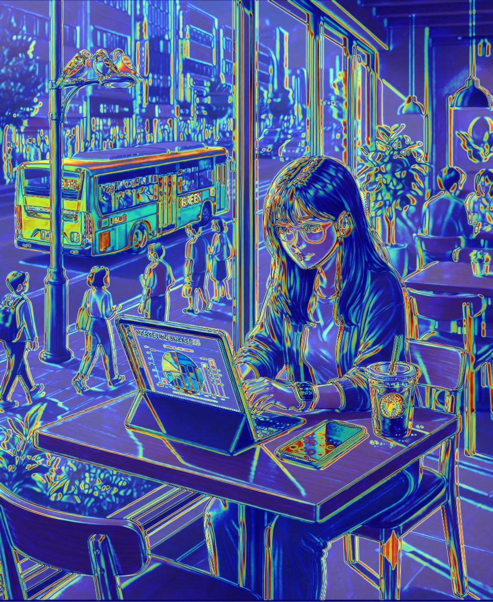
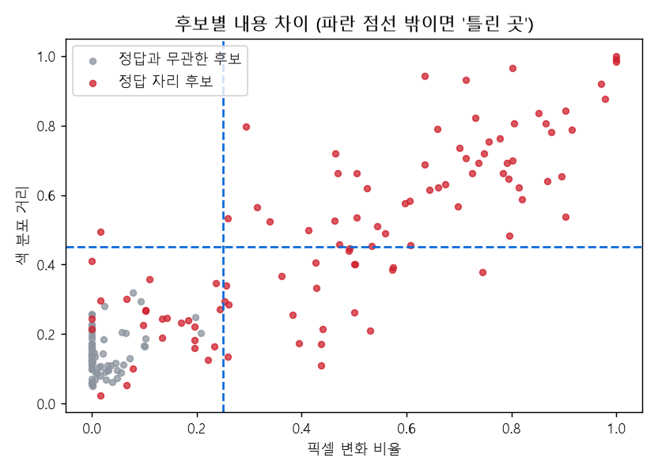

# 틀린그림찾기 핵 — 작업 기록

만들면서 겪은 문제와 해결 과정을 **흐름 단위**로 남긴다.

- 목표: 두 그림에서 다른 곳을 YOLO로 찾아 표시하기
- 아이디어: YOLO로 두 그림의 물체를 **전부 박스로 찾은 뒤, 박스끼리 비교**해서 틀린 곳을 찾는다

---

## 흐름 1. 틀린그림찾기 만들기

인터넷에서 받은 틀린그림찾기 도안(선 그림)으로 시작했다. AI에게 "틀린그림찾기 핵을 처음부터 만들어 달라"고 했더니, YOLO 대신 두 그림을 겹쳐서 픽셀 차이를 계산하는 영상처리 방식으로 만들었다. 그림 테두리를 제대로 찾지 못한 도안에서는 아래 안내 문구까지 그림으로 들어가 엉뚱한 곳에 큰 원이 잔뜩 생겼다.

원래 생각대로 YOLO로 물체를 찾아 비교하려고, 사전학습된 YOLOv8n을 도안 3장(토끼, 애벌레, 자동차)에 돌려 봤다. **3장 모두 물체를 하나도 찾지 못했다.** 자동차가 그려진 도안에서도 자동차를 못 찾았다. 사전학습 YOLO는 실제 사진으로 배운 모델이라, 흑백 선으로만 그린 그림은 물체로 보지 못한다.

---

## 흐름 2. 데이터셋 구하기가 어렵다

YOLO를 쓰려면 **YOLO가 알아볼 수 있는 그림**이면서 **정답이 있는** 틀린그림찾기가 필요하다. 그런데 인터넷의 틀린그림찾기는 대부분 선 그림이고, 실제 사진으로 된 것은 찾기 어려웠다.

그래서 COCO 사진(도시 장면)을 직접 편집해서 만들어 봤다(`src/make_city_dataset.py`). 물체를 지우고, 옮기고, 색을 바꾸는 방식이다. 하지만 **편집한 티가 너무 났다.** 지운 자리가 뭉개지고, 색을 바꾸면 아래처럼 사람이 초록색이 되는 식이라 AI 없이도 바로 찾을 수 있었다. 지우는 모델(LaMa)과 물체 모양 따내기(YOLOv8-seg)까지 써 봤지만 자연스럽게 만들기 어려웠고, 쓸 만한 도시 사진도 몇 장 안 됐다.

---

## 흐름 3. AI로 데이터 만들기

직접 편집하는 대신, **Gemini에게 틀린그림찾기 그림을 통째로 그려 달라고** 했다. 장면을 설명하고 "원본 A와 7군데 다른 B를 나란히 그려 달라"고 해서 5문제를 만들었다(카페, 빌딩 숲 광장, 지하철 승강장, 캠핑장, 동네 서점).

**YOLO가 이 그림을 알아볼까?** 선 그림 도안은 0개였는데, 이 그림에서는 물체를 많이 찾았다. 카페 그림에 YOLO11x를 돌린 결과다.

| 모델 | A | B |
|---|---|---|
| YOLO11n | 사람 11, 의자 9, 컵 2, 폰 2, 버스 1, 노트북 1 … | 거의 같음 (**새를 못 찾음**) |
| YOLO11x | 사람 11, 의자 5, **새 3**, 버스 1, 노트북 1, 컵 1, 폰 1 … | 사람 10, 의자 5, **새 2** … |

- 큰 모델(x)은 작은 참새까지 찾아서 **새 3마리 → 2마리** 차이가 박스 개수로 드러났다.
- 나머지 차이(버스 색, 태블릿 화면, 폰 화면, 컵 로고)는 물체가 그대로 있고 **내용만 바뀐 것**이라, 박스는 A와 B에서 똑같이 나온다. 박스만 비교해서는 못 찾는다.

**픽셀 비교는 왜 안 되나?** Gemini는 B를 그릴 때 그림 전체를 새로 그린다. 그래서 A와 B를 겹쳐 빼 보면 안 바뀐 곳도 테두리마다 차이가 생긴다(아래에서 빛나는 선). 흐름 1의 픽셀 차이 방식은 쓸 수 없고, **물체 단위로 비교하는 YOLO 방식이 필요한 이유**가 된다.

Gemini 그림에서 제목과 설명 글자를 잘라내고 A·B 그림만 남겼다(`src/prepare_pairs.py`). 정답은 그림을 보며 정리하고 위치를 박스로 적었다.

**결과**: 5문제, 차이 35개 (`dataset_ai/정답표.md`, 위치는 `dataset_ai/answers.json`)
- 대부분이 **바뀜**(같은 자리 물체가 다른 것으로)이다. 예: 핫도그 트럭 → 아이스크림 트럭, 비둘기 → 오리, 타자기 → 축음기
- 카페 그림은 7군데라고 했지만 6개만 찾았다. 반대로 광장 그림에는 Gemini가 말하지 않은 차이(파라솔 색)가 하나 더 있었다. 탐지기가 찾아낸 것이다.

---

## 흐름 4. 탐지기 만들기 (`src/detect_diff.py`)

### 방법

1. **탐지**: YOLO11x로 A와 B의 물체를 전부 찾는다.
2. **짝짓기**: 위치가 많이 겹치는(IoU ≥ 0.5) 박스끼리 A-B 짝을 짓는다.
   - 짝이 없는 박스는 한쪽에만 있는 물체다 (비둘기 → 오리처럼 개수가 달라짐)
   - 짝이 있는데 클래스가 다르면 다른 물체로 바뀐 것이다 (서점의 초록 책은 laptop, 남색 책은 suitcase로 잡힘)
   - 짝도 있고 클래스도 같으면 내용만 바뀌었을 수 있다 (버스 색, 폰 화면)
3. **확인**: 모든 후보 자리를 A·B에서 잘라 **내용**을 비교한다. 두 조각을 몇 픽셀 맞춘 뒤 색이 크게 다른 픽셀의 비율(픽셀 변화)과 색 분포 차이를 보고, 기준보다 크면 틀린 곳으로 본다. YOLO가 한쪽에서만 놓친 물체(내용은 같음)는 여기서 걸러진다.
4. **정리**: 같은 종류가 붙어 있으면 하나로 묶고(자판기 병 12개 → 1묶음), 겹치면 작은 박스만 남긴다.
5. **채점**: 탐지 박스가 정답 박스와 겹치거나(IoU ≥ 0.1) 정답 영역 안의 일부를 가리키면 찾은 것으로 본다.

### 시행착오

| 단계 | 바꾼 것 | 재현율 | 정밀도 |
|---|---|---|---|
| 1 | 박스 비교 + 색 분포 비교 | 32.4% | 34.2% |
| 2 | 채점 규칙 수정, 탐지 신뢰도 0.25 → 0.10 | 50.0% | 95.5% |
| 3 | 픽셀 변화 비교 추가, 같은 종류 묶기 | **65.7%** | **100%** |

> 재현율 = 정답 중 찾은 비율, 정밀도 = 탐지한 것 중 맞은 비율
> 3단계에서 탐지기가 찾은 파라솔 색 차이를 정답에 추가했다(34 → 35개). 파라솔을 빼고 원래 34개로 세면 재현율 64.7%, 정밀도 96.2%다.

1. **맞게 찾았는데 틀렸다고 채점됨** → 트럭 위 핫도그 장식, 자판기 안 병 하나처럼 정답의 **일부**만 가리키면 겹치는 비율(IoU)이 작아서 오답이 됐다. 정답 영역 안을 가리키면 인정하도록 채점 규칙을 고쳤다.
2. **고양이, 책을 못 찾음** → 탐지 신뢰도 기준 0.25에서는 서점 그림의 고양이와 책이 안 잡혔다. 0.10으로 낮췄다. 헛탐지가 늘어도 3번 확인 단계에서 걸러지므로 괜찮았다.
3. **화면·색 변화를 놓침** → 처음에는 YOLO 분류 모델의 특징 벡터로 모양 차이를 쟀는데, 거의 모든 후보가 0.0~0.2로 나와 차이를 구분하지 못했다. 조각을 맞춘 뒤 **픽셀 단위로 색이 바뀐 비율**을 재니 정답 자리와 아닌 자리가 잘 갈렸다(아래 그림, 회색은 거의 다 왼쪽 아래에 모임).
4. **자판기 병 12개가 따로따로 나옴** → 같은 종류가 붙어 있으면 하나로 묶었다.

### 결과

| 문제 | 정답 | 찾음 | 탐지 | 맞음 |
|---|---|---|---|---|
| cafe_01 | 6 | 3 | 3 | 3 |
| plaza_01 | 8 | 8 | 11 | 11 |
| subway_01 | 7 | 3 | 4 | 4 |
| camping_01 | 7 | 5 | 4 | 4 |
| bookstore_01 | 7 | 4 | 4 | 4 |
| **합계** | **35** | **23** | **26** | **26** |

> 빨간 박스: 탐지기가 찾은 곳 / 초록 박스: 찾은 정답 / 노란 박스: 놓친 정답

**놓친 12개**
- **YOLO가 모르는 물체 (8개)**: 안경, 전광판, 이어폰, 구두, 달, 마시멜로, 문 팻말, 모자. YOLO가 배운 80가지 물체(COCO)에 없어서 박스가 안 생기고, 박스가 없으면 비교할 후보도 없다.
- **찾았지만 차이가 작게 나옴 (4개)**: 태블릿 화면, 컵 로고, 시계 바늘, 열차 색. 물체 박스는 잡혔지만 바뀐 부분(그래프, 로고, 가는 바늘, 유리문 뒤 열차)이 박스에 비해 작거나 흐려서 기준을 넘지 못했다.

**한계**
- 기준값(픽셀 변화 0.25, 색 분포 0.45)을 같은 5문제를 보며 정했다. 새 문제에서도 맞는지는 문제를 더 만들어 확인해야 한다.
- 분수처럼 정답 영역이 큰 경우, 그 안에서 바뀐 뒤쪽 사람들을 가리켜도 맞음으로 셌다. 채점이 조금 너그럽다.
- 정밀도 100%는 5문제에서 헛탐지가 없었다는 뜻이다. 문제가 늘면 떨어질 수 있다.
